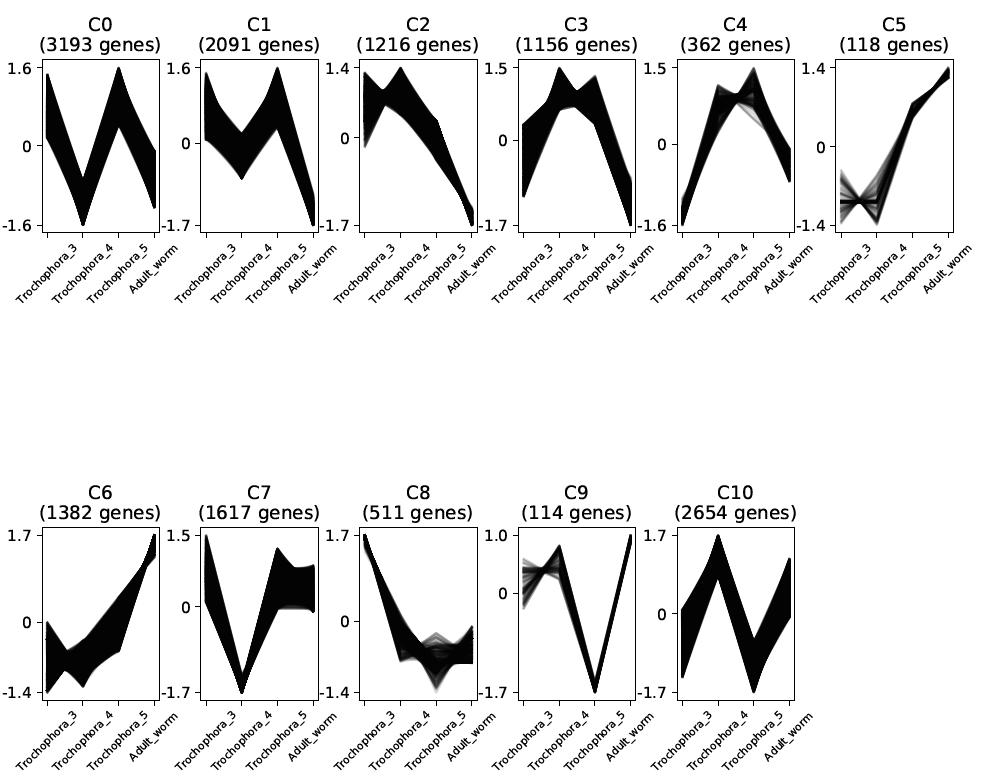

# *De novo* assembly and analysis of pogonophore *Siboglinum fiordicum* transcriptome at different larval stages

---

## Aim of the project: 

To study the molecular basis for the segmentation of *Siboglinum fiordicum* using transcriptomic data from different stages of the life cycle.

### Objectives 

- *De novo* transcriptome assembly of a non-model organism 
- Expression analysis at different stages of development

## Methods
- RNAseq libraries from 3 trochophores (before and after septum formation) and an adult organism were analyzed
- Primary quality control and raw data preparation were performed with __FastQC__, __Karect__, __fastp__
- *De novo* assembly with __Trinity__
- Sequence clusterization (__CD-HIT-EST__) 
- Estimation of the completeness (__BUSCO__) and quality (__TransRate__) of assembly, filtering contigs with low scores
- Determinaion of possible contamination by analyzing ribosome subunits sequences (__RNAmmer from Trinotate pipeline__) and transcriptome composition (__BlobTools__), filtering ribosomal, prokaritic (bacterial and archaeal), protists', vertebrate sequences
- Expression quantification with __Salmon__
- The determination of encoded amino acid sequences using a two-step analysis of __TransDecoder__
- Annotation (__NCBInt__, __NCBInr__, __SwissProt__, __PfamA__ and __eggNOG__ databases)
- Co-expression clusters building (__Clust__)
- Construction of orthogroups using __OrthoFinder__ and filtered reference sets of proteins from two other Annelida species: *Capitella teleta* (UniProt ID: UP000014760) and *Helobdella robusta* (UP000015101)
- Pathway enrichment analysis (__GeneOntology__, using __topGO__) of “genes” with predominant expression at a particular stage of the cycle

## Results
- We prepared a reference set of 29032 protein-coding sequences with significant expression (defined as sequences that has >=1 Transcript-Per-Million in at least one library and coding protein with length >=100 amino acid residues)
- After the expession analysis 18222 (63%) sequences have been found at all stages while 2914 (10%), 2067 (7%), 8373 (29%) and 2596 (9%) sequences demonstrate predominant expression at the stages 3, 4, 5 of trochophores and adults, respectively

- 11 co-expression clusters from 114 to 3193 in size were constructed

- 13745 orthogroups were built

- 903 GO-terms were “enriched”, selecting only terms with >=10 sequences with significant expression, among them:

 GO-term                  | life cycle stage | p-value          
--------------------------|------------------|------------------
 animal organ development | aT4, aT5         | 0.00608, 0.00141 
 mesoderm morphogenesis   | aT3              | 0.00131          
 regionalization          | aT5              | 0.00332          
 cell proliferation       | aT5              | 5.4e-06          
 response to bacterium    | Adult            | 2.6e-06          

## References
__Articles__
- Southward, E.C. Development of Perviata and Vestimentifera (Pogonophora). Hydrobiologia 402, 185–202 (1999). https://doi.org/10.1023/A:1003796626851
- Southward, Eve & Schulze, Anja & Gardiner, Stephen. (2006). Pogonophora (Annelida): Form and function. https://doi.org/10.1007/1-4020-3240-4_13 
- Bright, M., Eichinger, I. & von Salvini-Plawen, L. (2013). The metatrochophore of a deep-sea hydrothermal vent vestimentiferan (Polychaeta: Siboglinidae). Org Divers Evol 13, 163–188. https://doi.org/10.1007/s13127-012-0117-z

__Databases__
- https://www.ncbi.nlm.nih.gov/nucleotide/
- https://www.ncbi.nlm.nih.gov/protein/
- https://pfam.xfam.org/
- https://www.uniprot.org/
- http://eggnog-mapper.embl.de/

__Tools__
- FastQC, v0.11.5: https://www.bioinformatics.babraham.ac.uk/projects/fastqc/
- Karect, v1.0: Allam, A., Kalnis, P., & Solovyev, V. (2015). Karect: accurate correction of substitution, insertion and deletion errors for next-generation sequencing data. Bioinformatics, 31(21), 3421-3428. https://doi.org/10.1093/bioinformatics/btv415
- fastp, v0.20.1: Chen, S., Zhou, Y., Chen, Y., & Gu, J. (2018). fastp: an ultra-fast all-in-one FASTQ preprocessor. Bioinformatics, 34(17), i884-i890. https://doi.org/10.1093/bioinformatics/bty560
- Trinity, v2.9.1: Grabherr, M. G., Haas, B. J., Yassour, M., Levin, J. Z., Thompson, D. A., Amit, I., ... & Chen, Z. (2011). Trinity: reconstructing a full-length transcriptome without a genome from RNA-Seq data. Nature biotechnology, 29(7), 644. https://doi.org/10.1038/nbt.1883
- CD-HIT-EST, v4.7: Li, W., & Godzik, A. (2006). Cd-hit: a fast program for clustering and comparing large sets of protein or nucleotide sequences. Bioinformatics, 22(13), 1658-1659. https://doi.org/10.1093/bioinformatics/btl158
- BUSCO, v4.0.5: Seppey, M., Manni, M., & Zdobnov, E. M. (2019). BUSCO: assessing genome assembly and annotation completeness. In Gene Prediction (pp. 227-245). Humana, New York, NY. https://doi.org/10.1007/978-1-4939-9173-0_14
- TransRate, v1.0.1: Smith-Unna, R., Boursnell, C., Patro, R., Hibberd, J. M., & Kelly, S. (2016). TransRate: reference-free quality assessment of de novo transcriptome assemblies. Genome research, 26(8), 1134-1144. https://doi.org/10.1101/gr.196469.115
- RNAmmer, v1.2: Lagesen, K., Hallin, P., Rødland, E. A., Stærfeldt, H. H., Rognes, T., & Ussery, D. W. (2007). RNAmmer: consistent and rapid annotation of ribosomal RNA genes. Nucleic acids research, 35(9), 3100-3108. https://doi.org/10.1093/nar/gkm160
- Trinotate: Bryant, D. M., Johnson, K., DiTommaso, T., Tickle, T., Couger, M. B., Payzin-Dogru, D., ... & Bateman, J. (2017). A tissue-mapped axolotl de novo transcriptome enables identification of limb regeneration factors. Cell reports, 18(3), 762-776. https://doi.org/10.1016/j.celrep.2016.12.063
- BlobTools, v1.0: Laetsch, D. R., & Blaxter, M. L. (2017). BlobTools: Interrogation of genome assemblies. F1000Research, 6(1287), 1287. https://doi.org/10.12688/f1000research.12232.1
- Salmon, v1.0.1: Patro, R., Duggal, G., Love, M. I., Irizarry, R. A., & Kingsford, C. (2017). Salmon provides fast and bias-aware quantification of transcript expression. Nature methods, 14(4), 417. https://doi.org/10.1038/nmeth.4197
- TransDecoder, v5.5.0: https://github.com/TransDecoder/TransDecoder
- Clust, v1.10.8: Abu-Jamous, B., & Kelly, S. (2018). Clust: automatic extraction of optimal co-expressed gene clusters from gene expression data. Genome biology, 19(1), 1-11. https://doi.org/10.1186/s13059-018-1536-8
- OrthoFinder, v2.3.11: Emms, D. M., & Kelly, S. (2019). OrthoFinder: phylogenetic orthology inference for comparative genomics. Genome biology, 20(1), 1-14. https://doi.org/10.1186/s13059-019-1832-y
- topGO, v2.40.0: Alexa A, Rahnenfuhrer J (2020). topGO: Enrichment Analysis for Gene Ontology. R package version 2.40.0. https://doi.org/10.18129/B9.bioc.topGO
