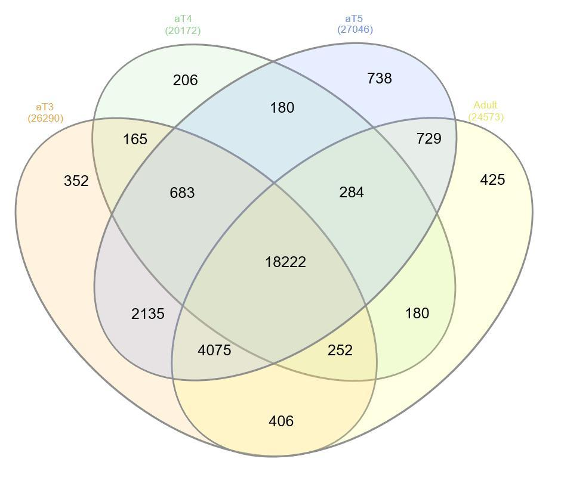
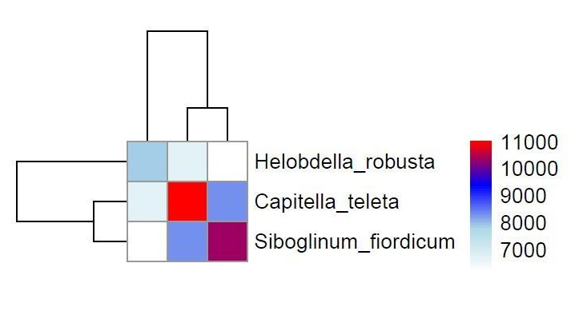

# *De novo* assembly and analysis of pogonophore *Siboglinum fiordicum* transcriptome at different larval stages

---

## Aim of the project: 

To study the molecular basis for the segmentation of *Siboglinum fiordicum* using transcriptomic data from different stages of the life cycle.

### Objectives 

- *de novo* transcriptome assembly of a non-model organism 
- expression analysis at different stages of development

## Methods
- RNAseq libraries from 3 trochophores (before and after septum formation) and an adult organism were analyzed
- primary quality control and raw data preparation were performed with __FastQC, Karect, FastP__
- *de novo* assembly with __Trinity__
- sequence clusterization (__CDHIT-est__) 
- estimation of the completeness (__BUSCO__) and quality (__TransRate__) of assembly, filtering contigs with low scores
- determinaion of possible contamination by analyzing ribosome subunits sequences (__RNAmmer from Trinotate pipeline__) and transcriptome composition (__BlobTools__), filtering ribosomal, prokaritic (bacterial and archaeal), protists', vertebrate sequences
- expression quantification with __Salmon (v1.0.1)__
- the determination of encoded amino acid sequences using a two-step analysis of __TransDecoder__
- annotation (__NCBInt, NCBInr, SwissProt, PfamA,__ and __eggNOG__ databases)
- co-expression clusters building (__Clust__)
- Construction of orthogroups using __OrthoFinder__ and filtered reference sets of proteins from two other Annelida species: *Capitella teleta* and *Helobdella robusta*
- pathway enrichment analysis (__GeneOntology__) of “genes” with predominant expression at a particular stage of the cycle

### Results
- We prepared a reference set of 29032 protein coding sequences with significant expression 
- Due to diffexpession analysis 18222 (63%) sequences active at all stages 2914 (10%), 2067 (7%), 8373 (29%) and 2596 (9%) sequences demonstrate predominant expression at the stages 3, 4, 5 of trophophores and adults, respectively

- 11 co-expression clusters from 114 to 3193 in size were constructed
- 13745 orthogroups were built

- 903 GO-terms were “enriched”, among them:
| GO-term                  | life cycle stage | p-value          |
|--------------------------|------------------|------------------|
| animal organ development | aT4, aT5         | 0.00608, 0.00141 |
| mesoderm morphogenesis   | aT3              | 0.00131          |
| regionalization          | aT5              | 0.00332          |
| cell proliferation       | aT5              | 5.4e-06          |
| response to bacterium    | Adult            | 2.6e-06          |

## References
__Articles__

__Databases__
- https://www.ncbi.nlm.nih.gov/nucleotide/
- https://www.ncbi.nlm.nih.gov/protein/
- https://pfam.xfam.org/
- https://www.uniprot.org/
- http://eggnog-mapper.embl.de/

__Tools__
